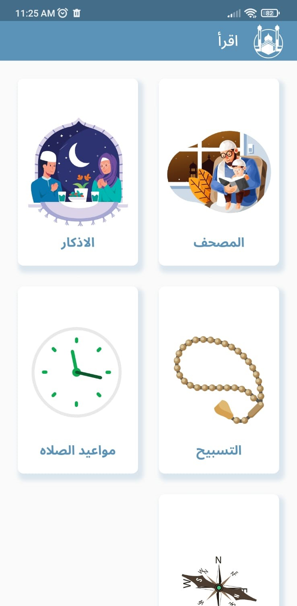
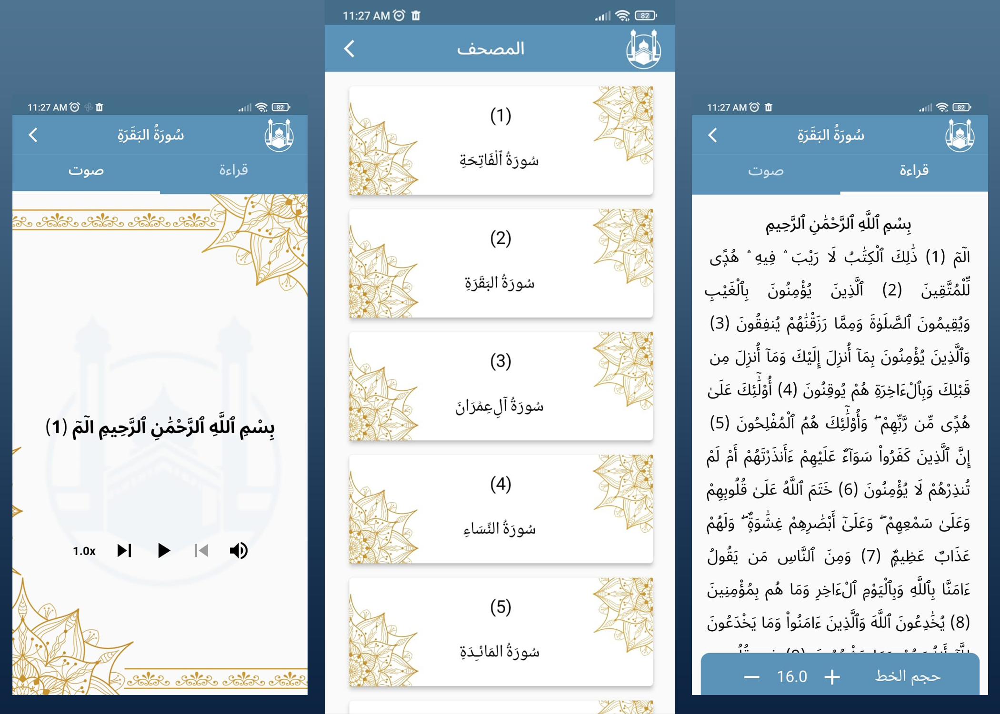
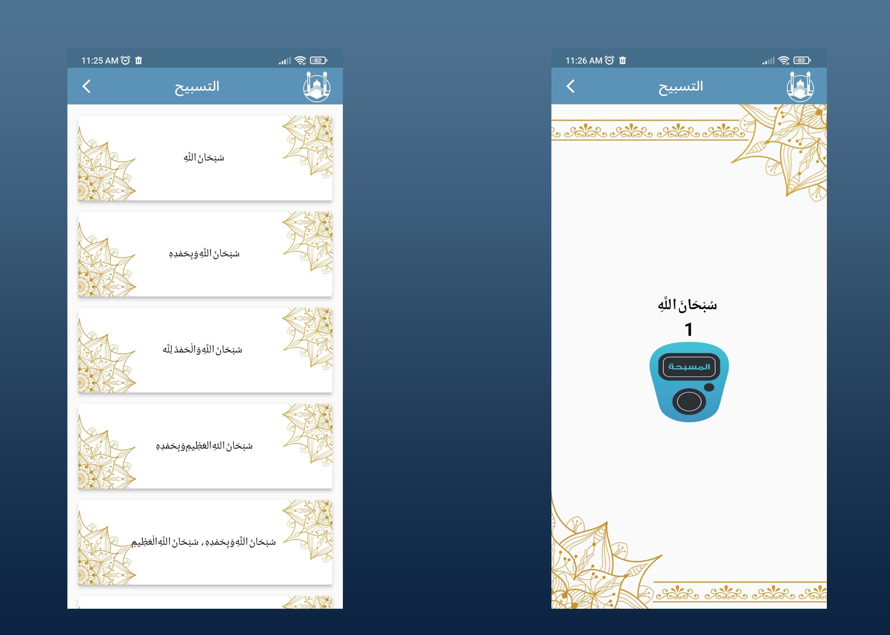
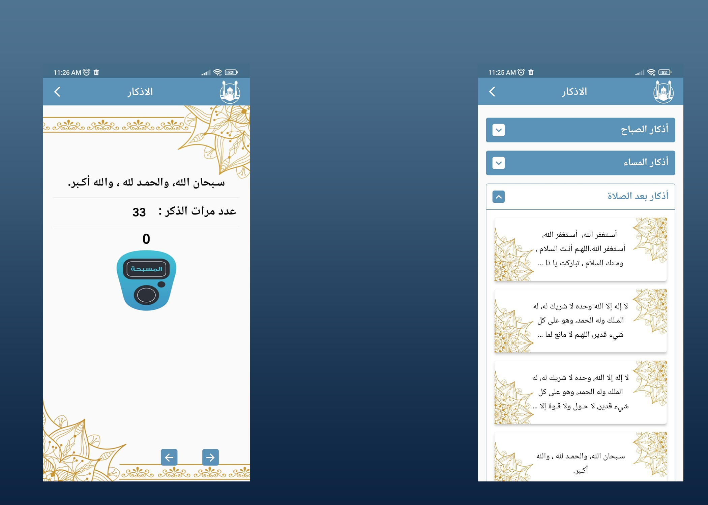
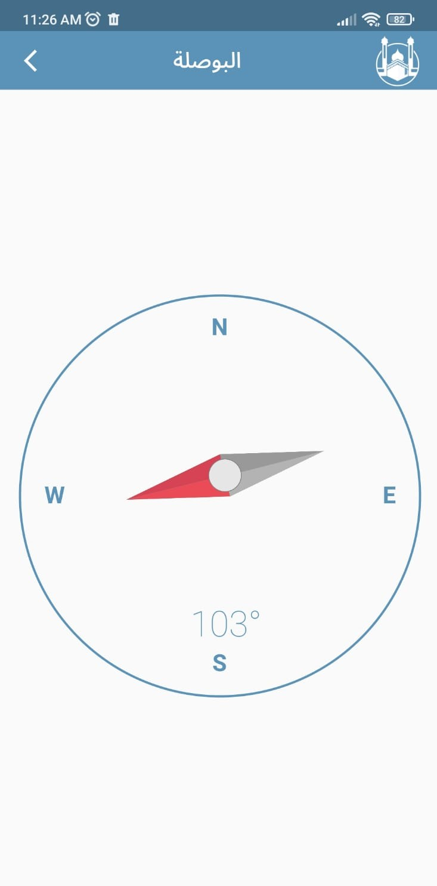
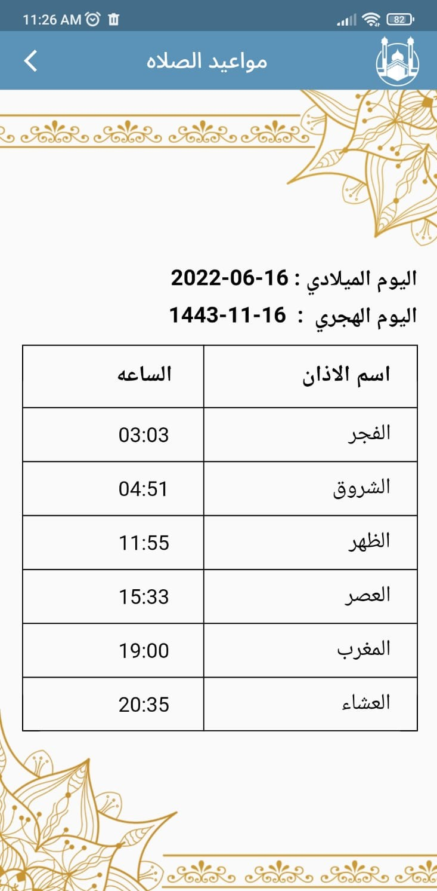

# Quran

## An application which help user to

  - read and listen to Quran .
  - know the prayer time .
  - reading azkar .
  - having compass .
  - make the tasbih easier .

## APK
https://www.mediafire.com/file/9rv73d7n5clzw5a/New_Quran.apk/file

## Packages
  - Dio
  - Lottie
  - Getx
  - sizer
  - location
  - just_audio
  - flutter_compass
  - flutter_offline
  - fluttertoast

| Splash | Home | No Internet |
|:------:|:-------:|:-------:|
||||

| Quran | 
|:------:|
||

| Tasbih | Azkar | 
|:------:|:------:|
|||

| Compass | Prayer Time | 
|:------:|:------:|
|||
